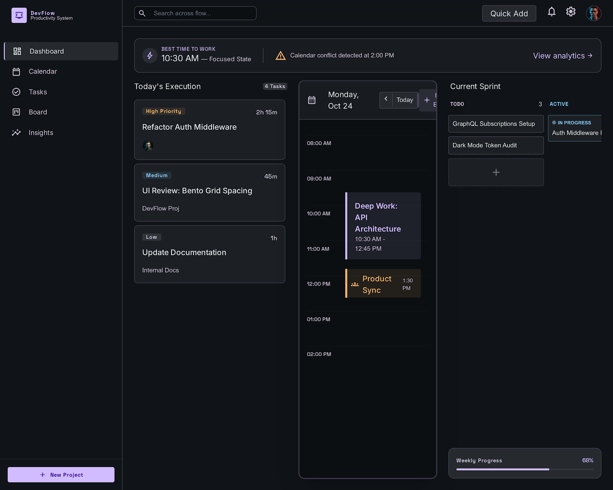
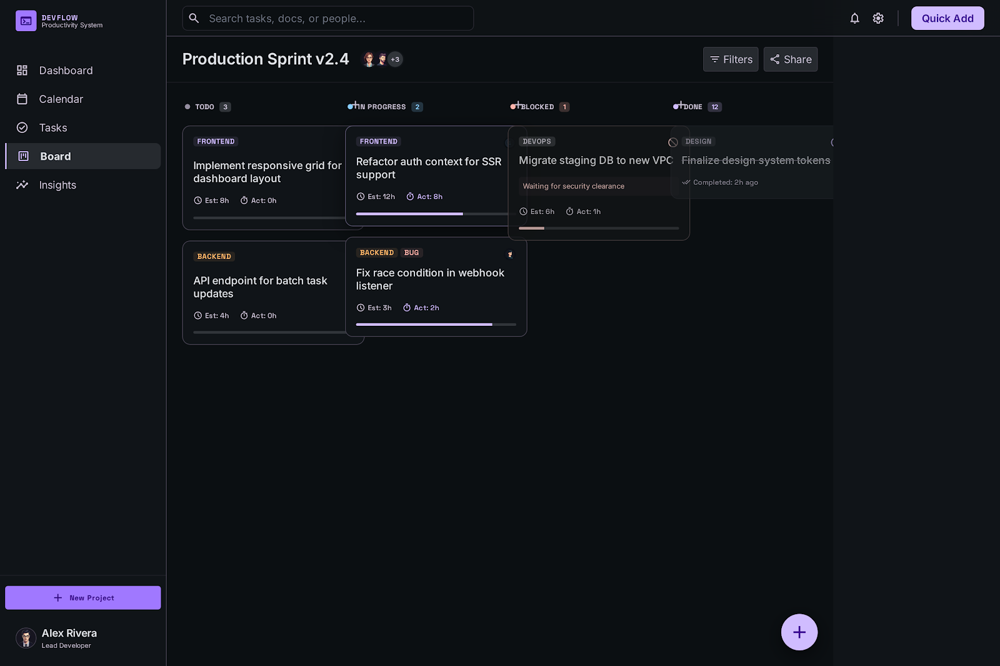
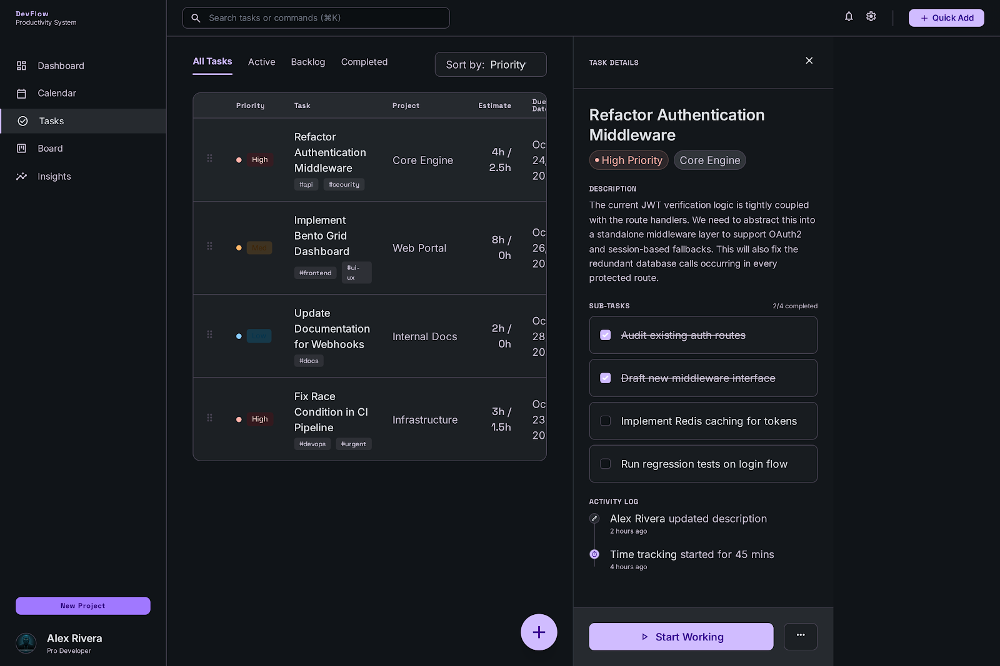
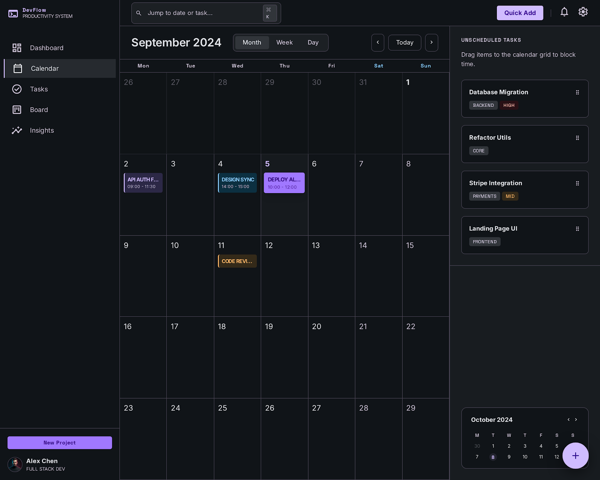

# DevFlow Productivity System

A futuristic, high-performance task management and productivity application designed specifically for developers. Features a premium dark mode UI, glassmorphism elements, and advanced developer metrics.

## 🚀 Screenshots

### Dashboard Overview


### Kanban Board


### Tasks View


### Calendar View


## ✨ Features

- **Futuristic UI**: State-of-the-art dark mode design with glassmorphism and subtle glowing accents.
- **Smart Dashboard**: Context-aware suggestions, "best time to work" analytics, and today's execution overview.
- **Advanced Kanban**: Drag-and-drop kanban board with built-in estimates, assignees, and blocked status handling.
- **Task Management**: Sortable, detailed list view of all tasks with priority indicators and tags.
- **Deep Integrations**: GitHub-style markdown, developer-focused activity logging, and time tracking.

## 💻 Tech Stack

- React 19
- Vite
- TypeScript
- CSS Variables / Custom Properties for Theming

## 🏃‍♂️ Running Locally

1. Install dependencies:
   ```bash
   npm install
   ```
2. Start the development server:
   ```bash
   npm run dev
   ```
